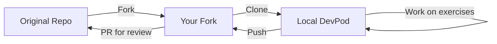

# Contributing & Fork Workflow

This guide explains how to work with this repository as a student.

## Fork Workflow Overview



## Step 1: Fork the Repository

1. Navigate to the original repository on GitHub
2. Click the **Fork** button in the top-right corner
3. Select your account as the destination
4. You now have your own copy at `github.com/YOUR-USERNAME/kubecraft`

## Step 2: Clone to Your DevPod

```bash
# Clone your fork
git clone https://github.com/YOUR-USERNAME/kubecraft.git

# Navigate to a lesson
cd kubecraft/lessons/clab/01-containerlab-primer

# Open in DevPod
devpod up .
```

## Step 3: Work on Exercises

Each lesson has exercises in the `exercises/` directory:

1. Read the exercise instructions in `exercises/README.md`
2. Create your solutions in the `exercises/` directory
3. Run the tests to validate your work:

```bash
# From the lesson directory
pytest tests/
```

4. If stuck, check `solutions/` for reference

## Step 4: Save Your Progress

```bash
# Stage your changes
git add exercises/

# Commit with a meaningful message
git commit -m "Complete Lesson 1 exercises"

# Push to your fork
git push origin main
```

## Step 5: Submit for Review (Optional)

If your instructor wants to review your work:

1. Push your completed exercises to your fork
2. Create a Pull Request from your fork to the original repo
3. Use the PR description to note any questions or challenges

### PR Title Format

```
[Lesson X] Your Name - Exercise Completion
```

### PR Description Template

```markdown
## Completed Exercises

- [x] Exercise 1: Deploy and Explore
- [x] Exercise 2: Modify the Topology
- [ ] Exercise 3: Challenge (optional)

## Questions

Any questions or areas where I got stuck...

## Self-Assessment

What I learned in this lesson...
```

## Keeping Your Fork Updated

If the original repository is updated:

```bash
# Add the original repo as upstream (one time)
git remote add upstream https://github.com/ORIGINAL-OWNER/kubecraft.git

# Fetch updates
git fetch upstream

# Merge updates into your main branch
git checkout main
git merge upstream/main

# Push to your fork
git push origin main
```

## Directory Structure for Your Work

Keep your work organized:

```
lessons/clab/01-containerlab-primer/
├── exercises/
│   ├── README.md              # Instructions (don't modify)
│   ├── my-topology.clab.yml   # Your work
│   ├── exercise1-notes.md     # Your notes
│   └── exercise2-solution.yml # Your solutions
└── solutions/                 # Reference (read-only)
```

## Tips for Success

1. **Don't modify files outside `exercises/`** - Keep the lesson structure intact
2. **Commit frequently** - Save your progress as you go
3. **Run tests early** - Catch issues before you're too deep
4. **Read error messages** - They usually tell you exactly what's wrong
5. **Use the solutions wisely** - Try first, then check if stuck

## Getting Help

- Check the [Troubleshooting Guide](docs/reference/troubleshooting.md)
- Search existing issues in the repository
- Ask in the course Discord/Slack channel
- Open a GitHub issue for bugs in the course material
