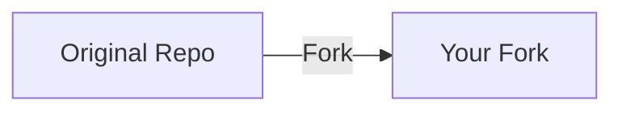

# Fork Workflow Guide

This course uses a fork-based workflow so you can track your progress and optionally submit work for review.

## Why Fork?

- **Your own copy** - Make changes without affecting the original
- **Track progress** - Commit your exercise solutions
- **Get updates** - Sync new content from the original repo
- **Submit work** - Create PRs for instructor review (optional)

## Step-by-Step Setup

### 1. Fork the Repository



1. Go to the original repository on GitHub
2. Click **Fork** (top-right)
3. Keep the default settings
4. Click **Create fork**

You now have: `github.com/YOUR-USERNAME/kubecraft`

### 2. Clone Your Fork

```bash
# Clone your fork (not the original!)
git clone https://github.com/YOUR-USERNAME/kubecraft.git

cd kubecraft
```

### 3. Set Up Upstream Remote

This allows you to get updates from the original repo:

```bash
# Add the original repo as "upstream"
git remote add upstream https://github.com/ORIGINAL-OWNER/kubecraft.git

# Verify remotes
git remote -v
# Should show:
# origin    https://github.com/YOUR-USERNAME/kubecraft.git (fetch)
# origin    https://github.com/YOUR-USERNAME/kubecraft.git (push)
# upstream  https://github.com/ORIGINAL-OWNER/kubecraft.git (fetch)
# upstream  https://github.com/ORIGINAL-OWNER/kubecraft.git (push)
```

## Daily Workflow

### Working on Exercises

```bash
# Navigate to lesson
cd lessons/clab/01-containerlab-primer

# Deploy the lab
sudo containerlab deploy -t topology/lab.clab.yml

# Work on exercises...

# When done, destroy the lab
sudo containerlab destroy -t topology/lab.clab.yml --cleanup

# Save your work
git add exercises/
git commit -m "Complete Lesson 1 Exercise 2"
git push origin main
```

### Getting Updates

When new content is added to the original repo:

```bash
# Fetch updates from upstream
git fetch upstream

# Merge into your main branch
git checkout main
git merge upstream/main

# Push to your fork
git push origin main
```

## Branching Strategy (Optional)

For more organized tracking, create branches per lesson:

```bash
# Create a branch for each lesson
git checkout -b lesson-01

# Work on the lesson...
git add .
git commit -m "Exercise 1 complete"

# When done with the lesson
git checkout main
git merge lesson-01
git push origin main
```

## Submitting Work for Review

If your instructor wants to review your work:

### 1. Ensure Your Work is Pushed

```bash
git push origin main
```

### 2. Create a Pull Request

1. Go to your fork on GitHub
2. Click **Pull requests** > **New pull request**
3. Set:
   - Base repository: `ORIGINAL-OWNER/kubecraft`
   - Base: `main`
   - Head repository: `YOUR-USERNAME/kubecraft`
   - Compare: `main`
4. Click **Create pull request**

### 3. Fill Out the PR Template

```markdown
## Lesson Completed

Lesson 1: Containerlab Primer

## Exercises

- [x] Exercise 1: Deploy and Explore
- [x] Exercise 2: Modify the Topology
- [x] Exercise 3: Challenge

## Notes

Any questions or observations from this lesson...

## Test Results

All tests passing: yes/no
```

## Handling Merge Conflicts

If your changes conflict with upstream updates:

```bash
# Fetch upstream changes
git fetch upstream

# Try to merge
git merge upstream/main

# If conflicts occur, Git will tell you which files
# Edit the files to resolve conflicts, then:
git add .
git commit -m "Resolve merge conflicts"
git push origin main
```

### Avoiding Conflicts

1. **Only modify files in `exercises/`** - Don't change lesson content
2. **Pull updates before starting new lessons** - Stay in sync
3. **Commit your work before pulling** - Keeps changes separate

## Quick Reference

| Task | Command |
|------|---------|
| Clone your fork | `git clone https://github.com/YOU/kubecraft.git` |
| Save work | `git add . && git commit -m "message" && git push` |
| Get updates | `git fetch upstream && git merge upstream/main` |
| Push updates | `git push origin main` |
| Check status | `git status` |
| See remotes | `git remote -v` |

## Troubleshooting

### "Permission denied" on push

You might be trying to push to the original repo:

```bash
# Check your remotes
git remote -v

# Ensure origin points to YOUR fork
git remote set-url origin https://github.com/YOUR-USERNAME/kubecraft.git
```

### "Already up to date" but missing content

```bash
# Force refresh from upstream
git fetch upstream --prune
git reset --hard upstream/main
```

> **Warning:** This discards local changes! Commit or stash first.

### Can't create PR

- Ensure you've pushed to your fork first
- Check that your fork isn't ahead in conflicting ways
- Verify you're creating PR to the correct base repo

## Next Steps

1. [Start Lesson 0](../../lessons/clab/00-docker-networking/) - Docker Networking Fundamentals
2. Commit your progress as you complete exercises
3. Sync updates periodically with `git fetch upstream`
