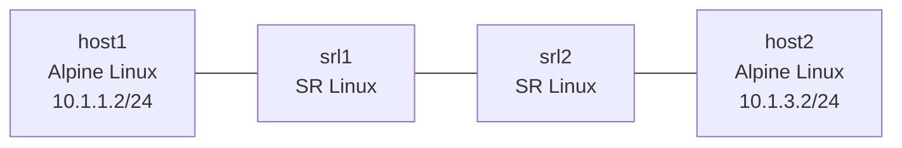

# Lesson 2: IP Fundamentals & Basic Connectivity

Configure IP addressing on network devices and verify connectivity using Ansible automation.

## Objectives

By the end of this lesson, you will be able to:

- [ ] Explain the networking stack (OSI Layers 1-4) and map each layer to Linux primitives
- [ ] Configure IP addresses and subnet masks on network devices
- [ ] Use Ansible with Jinja2 templates to automate network configuration
- [ ] Verify connectivity using ping, ARP tables, and interface commands
- [ ] Diagnose common IP connectivity issues (interface down, subnet mismatch, missing gateway)

## Prerequisites

- Completed Lesson 0: Docker Networking Fundamentals
- Completed Lesson 1: Containerlab Primer
- Ansible installed (`ansible --version`)
- Basic YAML knowledge

## Video Outline

### 1. The Networking Stack -- Layers 1-4 (3 min)

Every packet travels through a stack of layers. In Lesson 0, you built each one by hand:

| Layer | Name | Linux Primitive | Question It Answers |
|-------|------|-----------------|---------------------|
| L1 | Physical | veth pairs | "Is the cable connected?" |
| L2 | Data Link | MAC addresses, bridges (docker0) | "Which device on this wire?" |
| L3 | Network | IP addresses, subnets | "Which network? Which host?" |
| L4 | Transport | TCP/UDP ports | "Which application?" |

**Key insight:** When troubleshooting, work bottom-up. Is the link up? Can you see the MAC? Can you reach the IP? Is the port open?

### 2. IP Addressing & Subnets (3 min)

**IP addresses** have two parts: a network portion and a host portion. The subnet mask determines where the split is.

**CIDR notation:**
- `/24` = 256 addresses (10.1.1.0 - 10.1.1.255)
- `/30` = 4 addresses (common for point-to-point links)
- `/32` = 1 address (loopback or host route)

**"Same network?" test:** If two IPs share the same network portion, they can communicate directly at Layer 2 (via ARP + MAC). If they don't, traffic must go through a router at Layer 3.

**ARP (Address Resolution Protocol):** "I know the IP, but I need the MAC address to build the Ethernet frame. Who has 10.1.1.1?"

```bash
# View ARP table on a Linux host
arp -n

# View ARP table on SR Linux
show arpnd arp-entries
```

### 3. Ansible 101 with Jinja2 (3 min)

**Why automate?** We have 2 routers today. What if we had 200? Manual configuration doesn't scale.

Ansible has four key pieces:

**Inventory** -- which devices to manage:
```yaml
# ansible/inventory.yml
all:
  children:
    routers:
      hosts:
        srl1:
          ansible_host: 172.20.20.11
        srl2:
          ansible_host: 172.20.20.12
```

**Host vars** -- per-device data:
```yaml
# ansible/host_vars/srl1.yml
interfaces:
  - name: ethernet-1/1
    ipv4_address: 10.1.1.1/24
    description: Link to host1
```

**Jinja2 template** -- one template, many devices:
```jinja2

set / interface {{ iface.name }} subinterface 0 ipv4 address {{ iface.ipv4_address }}

```

**Playbook** -- the orchestration glue that ties inventory + vars + template together and pushes the config.

The template is the same for every router. Only the variables change. That's the power of templating.

### 4. Live Demo -- Deploy and Configure (3 min)

```bash
# Navigate to lesson directory
cd lessons/clab/02-ip-fundamentals

# Deploy the 4-node topology
containerlab deploy -t topology/lab.clab.yml

# Run Ansible to configure the routers
cd ansible
ansible-playbook -i inventory.yml playbook.yml
```

Ansible renders the Jinja2 template for each router using its host_vars, then pushes the CLI commands to SR Linux via the JSON-RPC API.

### 5. Verification Commands (1 min)

**On Linux hosts:**
```bash
docker exec clab-ip-fundamentals-host1 ping -c 3 10.1.1.1
docker exec clab-ip-fundamentals-host1 ip addr show eth1
docker exec clab-ip-fundamentals-host1 arp -n
docker exec clab-ip-fundamentals-host1 ip route show
```

**On SR Linux:**
```bash
docker exec -it clab-ip-fundamentals-srl1 sr_cli

# Inside SR Linux
show interface brief
show arpnd arp-entries
show network-instance default route-table ipv4-unicast summary
```

### 6. Recap + Teaser (30 sec)

Adjacent pings work -- devices on the same subnet can reach each other. But host1 cannot ping host2 across the routers. The routers only know about their directly connected subnets. For everything else, you need routing -- and that's Lesson 3.

## Lab Topology



## IP Addressing

| Subnet | Link | Left Device | Right Device |
|--------|------|-------------|--------------|
| `10.1.1.0/24` | host1 -- srl1 | host1: `eth1` = `10.1.1.2` | srl1: `e1-1` = `10.1.1.1` |
| `10.1.2.0/24` | srl1 -- srl2 | srl1: `e1-2` = `10.1.2.1` | srl2: `e1-1` = `10.1.2.2` |
| `10.1.3.0/24` | srl2 -- host2 | srl2: `e1-2` = `10.1.3.1` | host2: `eth1` = `10.1.3.2` |

Convention: routers get `.1`, hosts get `.2`.

## Files in This Lesson

```
02-ip-fundamentals/
├── README.md              # This file
├── topology/
│   └── lab.clab.yml       # 4-node linear topology
├── ansible/
│   ├── inventory.yml      # Router inventory
│   ├── playbook.yml       # Configuration playbook
│   ├── templates/
│   │   └── srl_interfaces.json.j2  # Jinja2 config template
│   └── host_vars/
│       ├── srl1.yml       # srl1 interface definitions
│       └── srl2.yml       # srl2 interface definitions
├── exercises/
│   └── README.md          # Hands-on exercises
├── solutions/
│   └── README.md          # Exercise solutions
├── tests/
│   └── test_ip_fundamentals.py  # Automated validation
└── script.md              # Video script
```

## Key Commands Reference

| Command | Purpose |
|---------|---------|
| `containerlab deploy -t topology/lab.clab.yml` | Deploy the lab |
| `containerlab destroy -t topology/lab.clab.yml --cleanup` | Destroy the lab |
| `cd ansible && ansible-playbook -i inventory.yml playbook.yml` | Apply router configs |
| `docker exec clab-ip-fundamentals-host1 ping -c 3 <ip>` | Ping from host1 |
| `docker exec -it clab-ip-fundamentals-srl1 sr_cli` | Connect to srl1 CLI |
| `show interface brief` | SR Linux: interface summary |
| `show arpnd arp-entries` | SR Linux: ARP table |
| `show network-instance default route-table ipv4-unicast summary` | SR Linux: routing table |

## Exercises

Complete the exercises in [exercises/README.md](exercises/README.md).

## Common Issues

**Ansible playbook fails to connect:**
```bash
# Verify the lab is running
containerlab inspect -t topology/lab.clab.yml

# Check management IP is reachable
ping -c 1 172.20.20.11

# Verify JSON-RPC is responding
curl -s http://172.20.20.11/jsonrpc -d '{"jsonrpc":"2.0","id":1,"method":"get","params":{"commands":[{"path":"/system/name","datastore":"state"}]}}' -u admin:NokiaSrl1!
```

**Ping fails between adjacent devices:**
```bash
# Check interface status on SR Linux
docker exec -it clab-ip-fundamentals-srl1 sr_cli -c "show interface brief"

# Verify IP addresses are configured
docker exec clab-ip-fundamentals-host1 ip addr show eth1
```

**Lab won't deploy:**
```bash
# Check Docker is running
docker ps

# Look for port or name conflicts with existing labs
containerlab inspect --all

# Try with debug output
containerlab deploy -t topology/lab.clab.yml --debug
```

## Navigation

Previous: [Lesson 1: Containerlab Primer](../01-containerlab-primer/) | [Course Index](../README.md) | Next: [Lesson 3: Routing Basics](../03-routing-basics/)

## Additional Resources

- [SR Linux Interface Configuration](https://documentation.nokia.com/srlinux/)
- [Ansible Getting Started](https://docs.ansible.com/ansible/latest/getting_started/)
- [Jinja2 Template Designer](https://jinja.palletsprojects.com/en/3.1.x/templates/)
- [Containerlab Topology Reference](https://containerlab.dev/manual/topo-def-file/)
- [CIDR Subnet Calculator](https://www.ipaddressguide.com/cidr)
